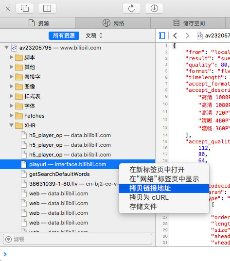

# Mimi Downloader

基于 Node.js 和 Electron 编写的Bilibili视频、弹幕下载器。

## 功能
目前实现的功能：

- 根据视频地址查询aid和cid以及视频详细信息
- 根据视频cid获取视频和弹幕文件的下载地址
- 下载视频 (.flv) 和弹幕文件 (.xml 或 .ass)，支持断点续传
- 某些情况下可能需要用户手动输入PlayUrl

## 使用方法
你需要安装 [Git](https://git-scm.com) 和 [Node.js](https://nodejs.org/en/download/) (以及 [npm](http://npmjs.com)) 来运行本项目。 在命令行/终端输入：
```bash
# Clone this repository
git clone https://github.com/stevenjoezhang/mimi-downloader
# Go into the repository
cd mimi-downloader
# Install dependencies
npm install
# Run the app
npm start
```
如果一切正常，会打开一个名为 "Mimi Downloader" 的新窗口。 输入视频链接，按照提示即可下载视频。  
如果程序提示需要输入PlayUrl，你可以如下图所示获取它：



下载完成后，可以使用 ffmpeg 将flv片段合成为一个文件：
```bash
cid=11090110
# Replace 11090110 with your video's cid
for f in $cid-*.flv; do echo "file '$f'" > temp.txt; done
ffmpeg -f concat -i temp.txt -c copy $cid.flv
```

## 制作者/鸣谢
* [Mimi](http://zsq.im) 本项目的开发者
* 田生 [XML 转 ASS 库](https://github.com/tiansh/us-danmaku) 以及 bilibili ASS Danmaku Downloader, Mozilla Public License 2.0
* soimort [you-get](https://github.com/soimort/you-get) MIT license 提供了部分api
* [md5](http://pajhome.org.uk/crypt/md5) BSD License

## 许可证
GNU General Public License v3  
http://www.gnu.org/licenses/gpl-3.0.html

## 待实现
开始/暂停下载

## 不同分支的内容
- master 主分支，采用了来自you-get的api，bangumi和movie需要手动输入PlayUrl
- backup 均需要手动输入PlayUrl
- you-get 未完成，bangumi和movie无法下载高清
