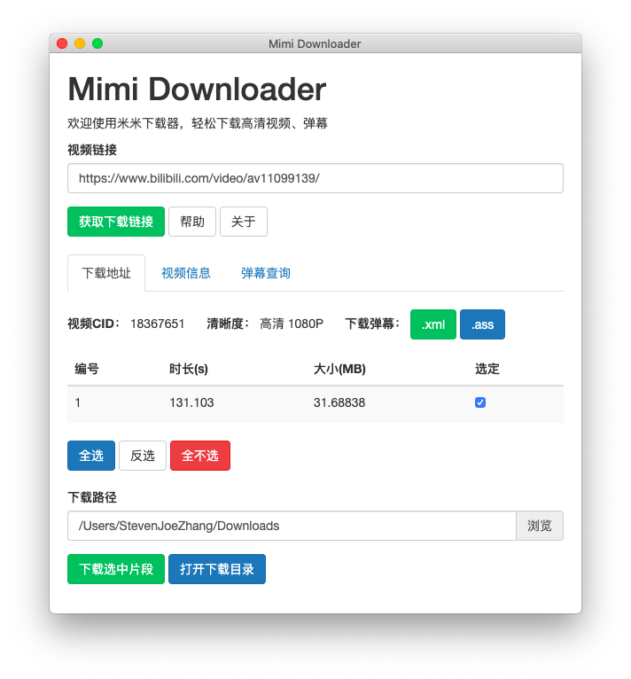

# Mimi Downloader

[中文/Chinese](README.md)

A Bilibili video downloader based on Node.js and Electron.



## Features

Download video (`.flv` or `.mp4`) and danmaku files (`.xml` or `.ass`).

## To Use

To clone and run this repository you'll need [Git](https://git-scm.com) and [Node.js](https://nodejs.org/en/download) (which comes with [npm](http://npmjs.com)) installed on your computer. From your command line:
```bash
# Clone this repository
git clone https://github.com/stevenjoezhang/bilibili-downloader.git
# Go into the repository
cd bilibili-downloader
# Install dependencies
npm install
# Run the app
npm start
```
If everything's OK, you'll see a new window named "Mimi Downloader". Input the URL of video (e.g. https://www.bilibili.com/video/av11099139/), then follow the guide to download files.  
If `PlayUrl` is required, you can get it like this:


You can combine flv video parts using ffmpeg:
```bash
cid=11090110
# Replace 11090110 with your video's cid
for f in $cid-*.flv; do echo "file '$f'" >> temp.txt; done
ffmpeg -f concat -i temp.txt -c copy $cid.flv
```

## Credits

- [Mimi](https://zhangshuqiao.org) Developer of this project.
- 田生 [XML to ASS Library](https://github.com/tiansh/us-danmaku) and bilibili ASS Danmaku Downloader, Mozilla Public License 2.0
- soimort [you-get](https://github.com/soimort/you-get) MIT license

## License

Released under the GNU General Public License v3  
http://www.gnu.org/licenses/gpl-3.0.html
